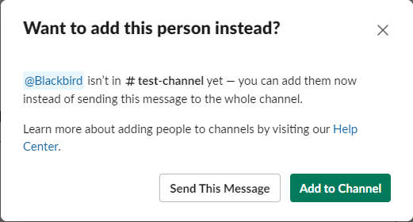
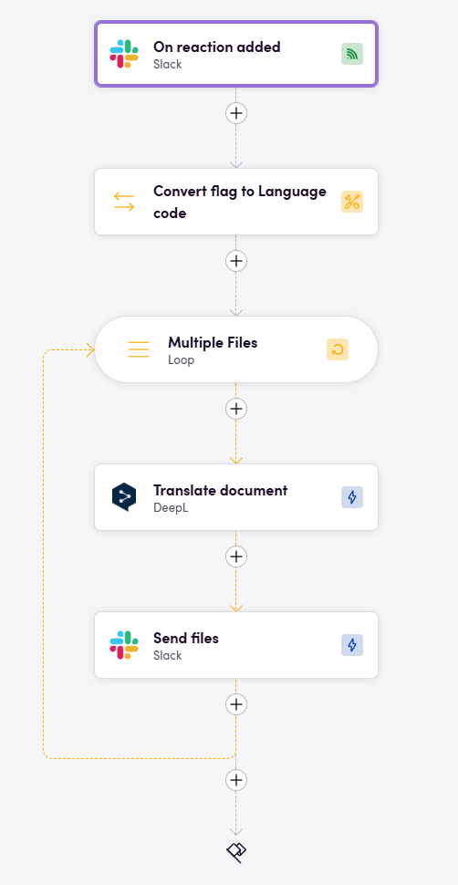

# Blackbird.io Slack

Blackbird is the new automation backbone for the language technology industry. Blackbird provides enterprise-scale automation and orchestration with a simple no-code/low-code platform. Blackbird enables ambitious organizations to identify, vet and automate as many processes as possible. Not just localization workflows, but any business and IT process. This repository represents an application that is deployable on Blackbird and usable inside the workflow editor.

## Introduction

<!-- begin docs -->

Slack is a messaging app for businesses that improves communication, teamwork, and decision-making. It allows people to collaborate easily, work on their own time, and share information in dedicated chat spaces.

## Before setting up

Before you can connect you need to make sure that you have a Slack account and you are part of a specific workspace. You need to be an Slack admin or have permission to connect external applications to your Slack channel. You can also [invite your Slack admin to Blackbird](https://docs.blackbird.io/concepts/nests/#users) in order for them to authorize the connection. 

### Enable webhooks

If you want to use Slack webhooks, you'll need to add Blackbird bot to the channels you're interested in after you've created a connection. There are two ways to do this.

The first way:

- Select a channel.
- Send a message with _@Blackbird_ content.
- Click _Add to channel_.
- Do the same for other channels you're interested in.

The second way:

- Go to the channel you selected during connection creation.
- Find _added an integration to this channel: Blackbird_ message.
- Click on _Blackbird_ -> _Add this app to a channel..._ -> select a channel from dropdown.
- Do the same for other channels you're interested in.

## Connecting

1. Navigate to Apps, and identify the **Slack** app. You can use search to find it.
2. Click _Add Connection_.
3. Name your connection for future reference e.g. 'My organization'.
4. Click _Authorize connection_.
5. Follow the instructions that Slack gives you, allowing Blackbird to access the selected workspace.
6. When you return to Blackbird, confirm that the connection has appeared and the status is _Connected_.

## Actions

### Messages

- **Send message** sends a message to a Slack channel or directly to a user. Additional optional inputs:
  - **Thread timestamp**: Set this value to the timestamp of a different message to reply to that message in a thread.
  - **Schedule at**: If set, the message will be sent at this time.
  - **Ephemeral user ID**: If set, the message will only be visible to this user. Only works inside channels. Does not work together with 'Schedule at'.
  - **Bot's username**: If set, the username of the bot will be displayed as this text.
  - **Send as user**: If set, the message will be sent as this user, instead of the bot.

- **Send files** sends files to a Slack channel. Additional optional inputs:
  - **Thread timestamp**: Set this value to the timestamp of a different message to reply to that message in a thread.
  - **Message**: Set the message to be sent along with the files.
  
- **Get message** given a channel ID and timestamp, this will return:
  - **Message text** the text of the message
  - **Sender user ID** the user ID of the Sender
  - **Message timestamp** the timestamp of this message. Can be used in other Slack actions and checkpoints.
  - **Message timestamp (Datetime)** the message timestamp as Date format.
  - **Thread timestamp** if the message was part of a thread, this is the thread timestamp that can be used in other Slack actions and checkpoints.
  - **Message timestamp (Datetime)** the thread timestamp as Date format.
  - **Channel ID** the ID of the channel this message was sent in.
  - **Files** all the files that were attached to this message.
  - **Reactions** all the reactions this message has

- **Update message** updates an existing message with new texts.
- **Delete message** deletes a message

### Reactions

- **Add reaction** adds a reaction to a message. Provides a dropdown of all possible reaction emojis.
- **Remove reaction** removes a reaction from a message. Note: The Slack bot can only remove reactions it has added.

### Users

- **Search users** returns all the users in this Slack team.
- **Get user** returns general and profile data about the user including but not limited to team ID, name, timezone, status and email.
- **Find user by email** returns the user associated with this email on this Slack instance.

## Events

- **On message** is triggered when any new message is sent to a channel. This event has a parameter _Trigger on message replies_ which is _False_ by default. If you want your bird to trigger on channel messages and message replies, set this parameter to _True_. If you use **On channel message** with **Send message in thread** in a single flow, you should set _Trigger on message replies_ to _False_ or leave it unspecified to avoid an infinite loop. If you want your bird to trigger only when a message has file attachments, set the _Trigger only when message has files_ to _True_, default is _False_.
- **On app mentioned** is triggered when the app is mentioned (@Blackbird). Useful to create workflow triggers that only start when specifically invoked by a user through Slack.
- **On reaction added**. Can be configured to a specific channel and a list of emojis it needs to trigger on. Also returns the "Reaction user ID" which is the user who added the reaction.
- **On member joined channel**.

> All message related events return the same output as the "Get message" action, so it also includes files and reactions.

## Example

In this example, we respond to reactions on Slack messages. These reactions will correspond to country flags. When triggered, the Bird will translate all the files the reactionw as added to into the requested language and respond with the translated files in a thread reply.

## Missing features

Slack is a huge app with a lot of features. If any of these features are particularly interesting to you, let us know!

## Feedback

Do you want to use this app or do you have feedback on our implementation? Reach out to us using the [established channels](https://www.blackbird.io/) or create an issue.

<!-- end docs -->
